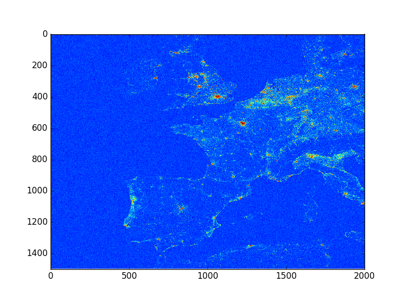
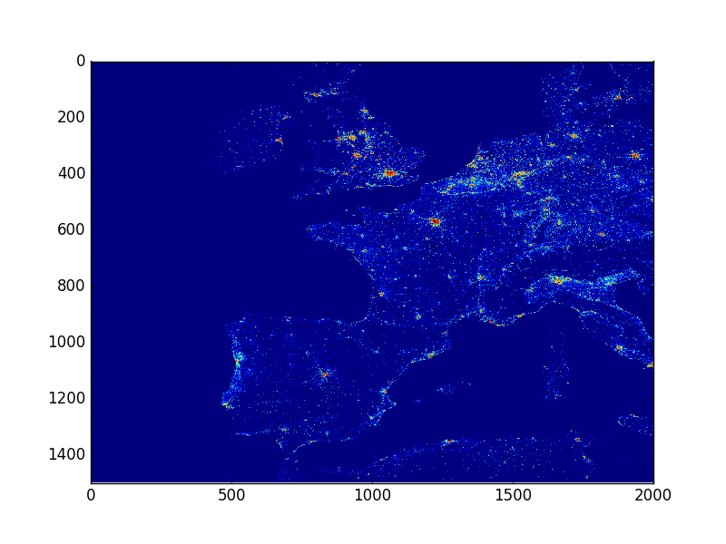
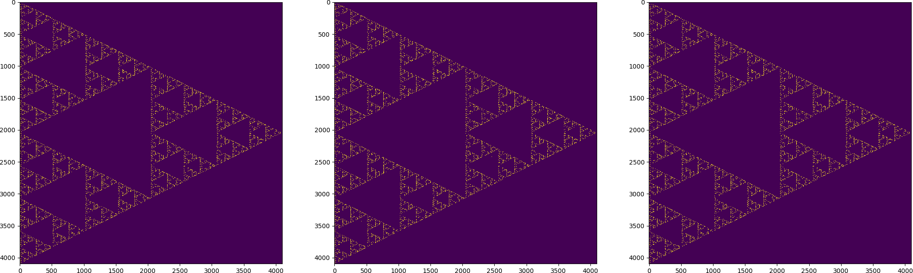
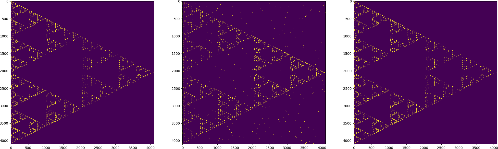

# GloBiMaps - A Probabilistic Data Structure for In-Memory Processing of Global Raster Datasets

We are happy to announce that our latest research on a randomized data structure GloBiMap
for high-resolution, low-cardinality global raster information (e.g., which place on Earth
contains a building) has been selected for full-paper presentation at ACM SIGSPATIAL GIS.
We are excited about the positive reviews. This repository contains some  source
code, which has been simplified to be independent from our Big Geospatial Data infrastructure.

The following images illustrate the power by showing urban regions over Europe by color-coding 20x20 pixel patches.

## 8 MB
There is some noise, but the structures are clear



## 64 MB
Errors are already rare.



Note that we have an error correction methodology in the paper allowing you to have an exact representation!


# Building

This is an illustrative library and needs a lot of up-to-date dependencies to work. It has been tested on Debian and Ubuntu,
should work with minor changes on all major platforms. But you have to make sure some things are in place:

## Python Build Environment

You should have headers and libraries for python installed. The Makefile uses
```
pkg-config --cflags python
```
and
```
pkg-config --libs python
```

These should return the right linker flags.

## Install Boost
Download a recent version of boost (new enoguh, probably not the one from your distribution, but who knows).
For this project, I was using Boost 1.71_0. Download the source, go to the directory and
```
./bootstrap.sh --with-libraries="python,system"
./b2 -j8
sudo ./b2 install
```
This should bring libraries to /usr/local/lib, which we will be using. It can be easier for you not having installed another version of boost like the old ones from your distribution. But it is possible...

## Install Boost::Numpy (before was Boost::Python::Numpy, now it is independent)
Roughly like this:
```
git clone https://github.com/ndarray/Boost.NumPy
cd Boost.Numpy
mkdir build
cd build
cmake ..
make 
sudo make install
```
This is actually, where the build system failed for my Debian mixed system with Python2 and Python3. Building Boost without python3 support solved the problem for me. You can do this, of course, only temporary.

## Now some minor changes:
Boost has built a lot of python libraries for you, but they are named after the version (e.g., libbooost_python27.so). These are (currently) hardcoded in the Makefile. Update, if you don't have these names, otherwise you will see linker errors.


## Now do it
In the directory, you should just make:
```
make
```
This creates a globimap.so, which you can put to your python path or into the project directories where you want to work.
If this is in the current directory, you can import it as a library, for example:

```
martin@werner:~/git/globimap/src$ python
Python 2.7.16 (default, Apr  6 2019, 01:42:57) 
[GCC 8.3.0] on linux2
Type "help", "copyright", "credits" or "license" for more information.
>>> import globimap as gm;
>>> 
```
This might fail, if you did not reboot or do anything after building all the shared libraries. In this case, it looks like
this:
```
martin@werner:~/git/globimap/src$ python
Python 2.7.16 (default, Apr  6 2019, 01:42:57) 
[GCC 8.3.0] on linux2
Type "help", "copyright", "credits" or "license" for more information.
>>> import globimap as gm;
Traceback (most recent call last):
  File "<stdin>", line 1, in <module>
ImportError: libboost_numpy27.so.1.71.0: cannot open shared object file: No such file or directory
>>> 
```
and you only need to refresh the linker using ldconfig
```
martin@werner:~/git/globimap/src$ sudo ldconfig
[sudo] Passwort für martin: 
```

# Using the illustrative implementation:


# API Overview

## Functions exported in the Python module

All functions you should use are exported in the class globimap, which you can instantiate more than once
in your code.

The functions are:

- rasterize (x,y, s0, s1): rasterize region from x,y with width s0 and height s1 and get a 2D numpy matrix back
- correct (x,y,s0,s1): apply correction (on local data cache, use rasterize before! There is no check you did it!)
- put (x,y): set a pixel at x,y
- get (x,y): get a pixel (as a bool)
- configure (k,m): set k hash functions and m bit (does allocate!)
- clear (): clear and delete everything
- summary(): give a summary of the data structure as a string (use for debugging from python, takes some time to generate)
- map(mat,o0,o1): basically "places" the matrix mat at o0, o1 setting values, which must be binary.
- enforce(mat, o0,o1): basically adds error correction information for the region map with these parameters would affect.

Some patterns / remarks:

- you should !not! call correct without rasterize. Rasterize uses the probabilistic layer and correct applies error correction to this very same storage.
- If you don't call put (or map) after using enforce, you are guaranteed to have no errors. If you add something, new errors can appear.


# A nice application: Sierpinski's Triangle

In src/sample.py you find a complete walk-through of how globimaps can be applied. To keep this git small, we generate
a sparse dataset algorithmically, in fact, we generate a point cloud that is dense in Sierpinski's triangle, that is, for
n to infinity, this becomes the Sierpinski triangle. In this way, our dataset is generated in 12 LOCs instead of downloading
a few megabytes.

I tuned parameters to show some things: First of all, the size is 4096x4096 pixels and we insert 500,000 points following
the so-called Chaos game: Having chosen some random location (usually inside the triangle, though this does not matter in the long run), randomly select one of the corners and update the current location to the middle of the straight line connecting the current location with the corner. Doing so infinitely creates a dense set of points in the Sierpinski fractal. Good for our purpose, as we need a sparse binary dataset.

With these parameters, two obvious ways of representing this are available:

- As a numpy array (as it is) with 32 bit per entry, that is exactly 64 MB.
- As a bit array (with one bit per pixel), that is 2 MB
- As a set of coordinates (with two bytes per coordinate, that is 4 byte per set pixel) ~1,4 MB (depends randomly on the start point)

Hence, let us look for a good size for a GloBiMap that helps us with this dataset. What about 1MB?

Okay, 1 MB is 2^23 bits, therefore, you see logm=23 in the source code.

With this, we can afford 15 hashes and get great results. Running sample.py results in

```
Memory: 1024.000000 KB
Hashes: 15 
(4096, 4096)
100%|██████████| 500000/500000 [00:04<00:00, 101727.62it/s]
Ones: 349162
Coordinate Memory (4 bytes): 1396648
Raster Memory (1 bit per pixel): 2048 KB
logm:23mask=83886070x7fffff
filter.size=8388608
Step 1: Probabilistic Encoding
Step 2: Error Correction Information
{
"storage:": 1,
"ones:": 3895346,
"foz:": 0.535639,
"eci": 163
}

Step 3: Rasterize
Have 0 errors for a BER of 0.000000
```

That is, first of all, the capacity is used well (about 0.53 FOZ), the ECI is 163 pixels (that is another 650 bytes for error correction information). And finally, it is error-free (after applying error correction algorithm).

And it shows the result as a single plot like this one:



If you now go a bit more agressive, you can chose half a megabyte for starge.As a consequence,
the number of hash functions should (roughly) be half. The following image has been generated with
0.5 MB of storage and 8 hash functions. Now, you see uniform noise in the random layer. But still, the number
of errors is only 50,633, that is 200k of error correction information (2x 2 byte per pixel). Hence, an error-free
data structure consumes only about 700k, much less than the one megabyte we chose for the almost error-free version.



# Resources

This package is meant to model sparse, global datasets in spatial computing. As these are typically large and copyrighted,
they did not make it to Github, but you will find information on those on my web page (sooner or later) as
well as in the paper.

- https://martinwerner.de/blog/2019/10/06/globimaps-sigspatial.html
- Werner, M. (2019). GloBiMaps - A Probabilistic Data Structure for In-Memory Processing of Global Raster Datasets. In 27th ACM SIGSPATIAL International Conference on Advances in Geographic Information Systems (SIGSPATIAL ’19).


The paper is directly available from here: https://martinwerner.de/pdf/2019globimap.pdf


